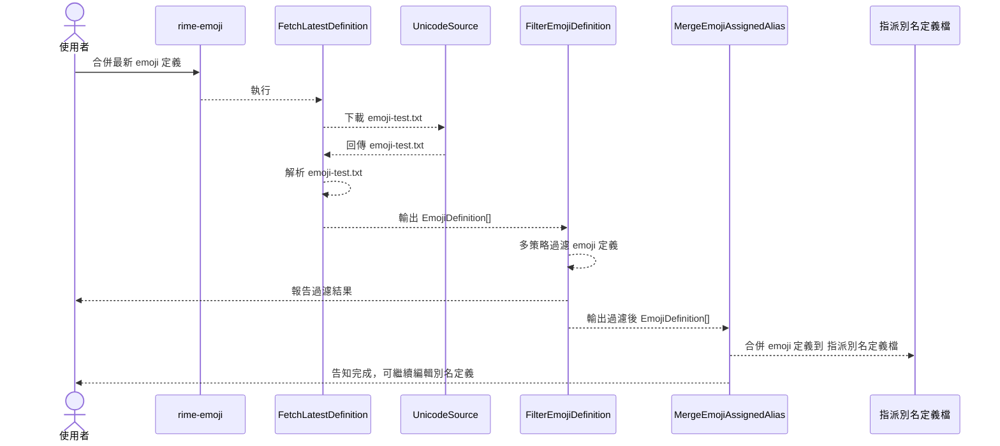
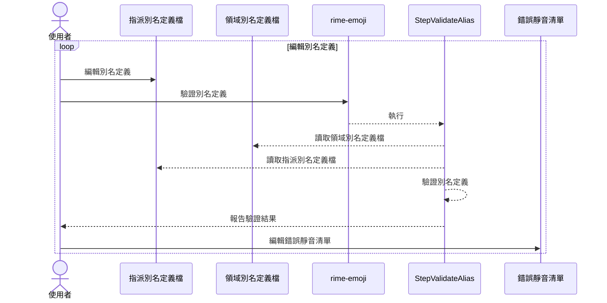
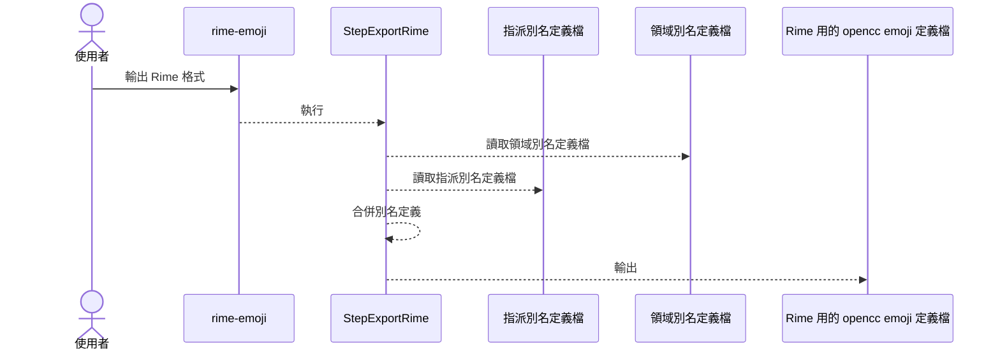

# 🧩 rime-emoji

建立一套可維護、可驗證、可擴充的 emoji 中文別名處理工具鏈，並最終輸出為 Rime 輸入法用的 OpenCC 格式定義檔。

---

## 🔧 專案定位與設計理念

本專案為典型的 Pipeline 資料處理專案，其特色包含：

- 🧱 多階段處理：每個處理步驟明確獨立，便於理解與重用
- 🧪 開發導向資料產出：每個階段會輸出中繼資料，可用於觀察、測試、或作為下一步輸入
- 📦 具備工程穩定性與資料科學探索彈性：結構嚴謹但可允許反覆實驗
- 🧭 Clean Architecture + DI 策略：可替換的資料來源與策略，易測試、易維護

## 🏗 專案結構

```text
src/
├── entities/ # 📘 核心資料模型（emoji 定義、別名結構）
├── funcs/ # 🔁 每個處理階段（Step）可獨立執行或組合
│ └── Step.Xxx.ts # 各個步驟（fetch、filter、merge...）
├── services/ # 💾 副作用與策略（Repo、輸出、過濾）
├── utils/ # 🛠 通用工具，如 YAML 讀寫
├── index.ts # 🧩 CLI 入口，組合 Step 為命令
test/
├── Step.\*.test.ts # 🎯 每個步驟可單獨測試，也可用作臨時執行器
└── XxxRepo.test.ts # ✴️ Interface-based 測試可覆蓋多實作
```

## ✅ 主要處理階段

| 階段                | 模組                          | 說明                                                             |
| ------------------- | ----------------------------- | ---------------------------------------------------------------- |
| 1️⃣ 抓取最新定義     | `StepFetchLatestDefinition`   | 從 Unicode 官網下載 emoji-test.txt 並解析為 `EmojiDefinition[]`  |
| 2️⃣ 過濾定義         | `StepFilterEmojiDefinition`   | 應用一組可配置策略（膚色、性別等）排除不必要 emoji               |
| 3️⃣ 建立可維護別名檔 | `StepMergeEmojiAssignedAlias` | 合併定義並產出 emoji 為主體的分類別名檔（群組化 YAML）           |
| 4️⃣ 驗證別名完整性   | `StepValidateDefinitionAlias` | 驗證 group/subgroup/emoji alias 是否缺漏，並支援錯誤 mute 控制   |
| 5️⃣ 定義語意多義別名 | `DomainAliasRepo` + YAML      | 支援一個 alias 在多個 domain 中對應不同 emoji                    |
| 6️⃣ 輸出輸入法定義檔 | `StepExportRime`              | 合併所有別名來源，輸出為 `OpenCCEmojiForRime` 所需格式（`.txt`） |

👉 每一階段都可透過 Step 執行、測試、或用作後續開發基礎。

## 🧱 核心資料模型

| 模型                 | 說明                                                |
| -------------------- | --------------------------------------------------- |
| `EmojiDefinition`    | emoji 的基本描述與結構（來源於 Unicode）            |
| `EmojiAssignedAlias` | group/subgroup/emoji 各自的中文別名（分類別名）     |
| `DomainAlias`        | 輸入詞為主體的語意定義（可對應多 emoji，多 domain） |

## 🧭 系統資料流總覽：上下游與產出責任

### 抓取並更新最新定義



### 編輯別名定義並檢查



### 輸出 OpenccEmojiForRime 格式


