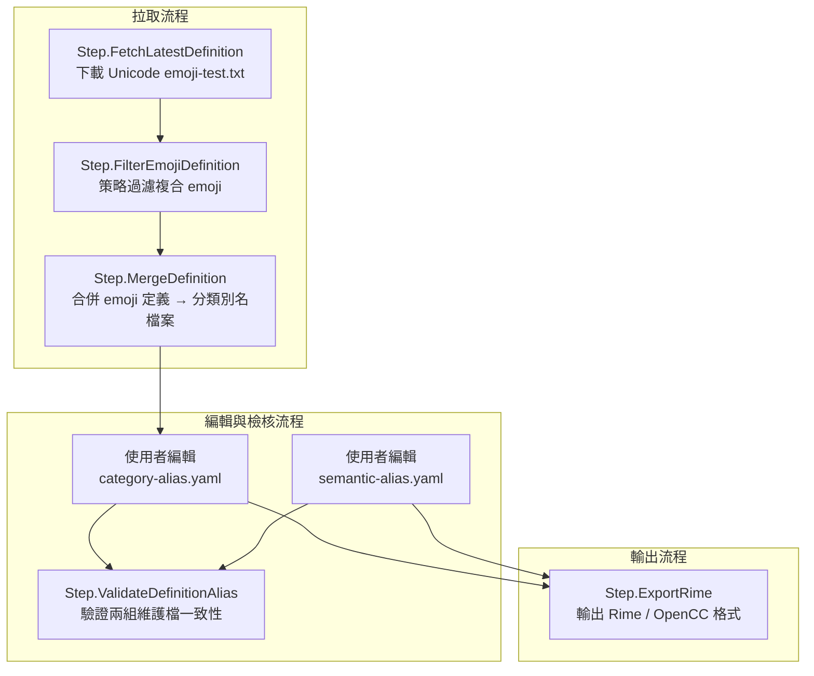

# 🧩 rime-emoji

建立一套可維護、可驗證、可擴充的 emoji 中文別名處理工具鏈，並最終輸出為 Rime 輸入法用的 OpenCC 格式定義檔。

---

## 📜 CLI 指令總覽

| 指令                  | 說明                                                       |
| --------------------- | ---------------------------------------------------------- |
| `bun run fetch`       | 下載並解析 emoji-test.txt                                  |
| `bun run filter`      | 套用策略過濾 emoji 定義                                    |
| `bun run merge`       | 合併到 emoji-category-alias.yaml                           |
| `bun run validate`    | 檢查 category alias 與 semantic mapping 的一致性與潛在問題 |
| `bun run export-rime` | 輸出為 Rime/OpenCC 使用格式的 `.txt` 或 `.dict.yaml`       |

## 🔜 整體流程圖

### 抓取並更新最新定義



---

## 🧹 模組整理與清除建議

### 🔥 建議移除

| 檔案                                              | 原因                       |
| ------------------------------------------------- | -------------------------- |
| `src/funcs/StepBuildSemanticAliasFromCategory.ts` | 誤導性邏輯，與語意模型不符 |
| `test/StepBuildSemanticAliasFromCategory.test.ts` | 測試對象已不存在           |
| `README.md` 中提及自動建構 SemanticAlias 的部分   | 避免誤導維護流程           |

### 🧱 模組命名與文件補強（配合刪除作業）

| 原名                   | 建議新名                     | 理由                                              |
| ---------------------- | ---------------------------- | ------------------------------------------------- |
| `SemanticAlias.ts`     | `SemanticAliasMapping.ts`    | 符合你的概念定位：這是語意導向對應表              |
| `SemanticAliasRepo.*`  | `SemanticAliasMappingRepo.*` | 對應資料模型名稱一致性                            |
| CLI 名稱 `export-rime` | 可保留                       | 表達輸出語意清楚，並非依賴某個特定 alias 結構來源 |

---

🧭 下一步建議
📌 1. 更新 CLI 文件 / README：

    移除 build-semantic-alias

    加入 semantic-alias-mapping.yaml 的語意說明

    說明這是平行來源而非派生結果

🧪 2. 重構測試覆蓋：

    移除 build-semantic-alias 測試

    確保 Step.ExportRime.test.ts 同時測試從兩個來源合併後的輸出邏輯

📦 3. 設計封裝：

    CLI 封裝為 bunx rime-emoji 套件時，這五個指令即為預設支援的維護流程

---

## 🧩 Emoji 中文別名維護格式

本專案採用 可讀性與可維護性兼具 的 YAML 檔案結構，將 emoji 的中文別名維護分為兩種層次：

### 📂 分類別名（Category Alias）

定義：
根據 Unicode 提供的群組與子群組分類（group / subgroup），為 emoji 指派中文別名。此類別名主要反映 emoji 原始語意與結構分類，用於分類呈現與基本語義支援。

路徑：

```txt
category-alias/
```

檔案命名規則：
每個主分類（group）對應一個 YAML 檔，檔名採 URI-safe 編碼（空格 → _, & → \_26_ 等）。

範例檔案：

```txt
category-alias/Activities.yaml
category-alias/Animals_20_26_20Nature.yaml
```

檔案格式：

```yaml
name: Activities
subGroups:
  - name: event
    alias: 活動 節慶
    emojis:
      - emoji: 🎃
        alias: 南瓜燈 南瓜
        name: E0.6 jack-o-lantern
```

> ✅ alias 欄位使用空格分隔多個別名
> ✅ name 欄位為 Unicode 提供的原始英文名稱（可含版本標記）

## 📂 語義別名（Semantic Alias）

定義：
以實際使用情境、行為意圖、應用語境為導向，建立 alias（輸入詞） → emoji 列表 的語義對應表。此類別名常見於工程開發、系統狀態、工作流程等場景。

路徑：

```txt
semantic-alias/
```

檔案命名規則：
每個檔案名稱代表一個語義主題，例如 development.yaml、status.yaml、interaction.yaml。檔名不影響輸出結構。

範例檔案：

```txt
semantic-alias/development.yaml
```

檔案格式：

```yaml
- alias: 錯誤
  emojis: ❌ 🚫 💥
- alias: 成功
  emojis: ✅ ☑️ ✔️
- alias: 重啟
  emojis: 🔄
```

> ✅ emojis 欄位使用空格分隔
> ✅ 支援多對多關係（同一 emoji 可屬於多個語義）

### 📌 對比總覽

| 類型     | 中文名稱       | 英文名稱          | 儲存位置                         | 結構維度                     |
| -------- | -------------- | ----------------- | -------------------------------- | ---------------------------- |
| 分類別名 | Category Alias | `category-alias/` | group/subgroup → emoji → aliases | Unicode 分類結構、內容整理   |
| 語義別名 | Semantic Alias | `semantic-alias/` | alias → emoji\[]                 | 應用語境、輸入字典、場景感知 |

### 🔧 程式內部對應型別

```typescript
// 分類別名（檔案）
export type CategoryAliasGroupFile = {
  name: string;
  subGroups: {
    name: string;
    alias: string;
    emojis: {
      emoji: string;
      alias: string;
      name: string;
    }[];
  }[];
};

// 語義別名（檔案）
export type SemanticAliasEntry = {
  alias: string;
  emojis: string; // 空格分隔字串
};
```
